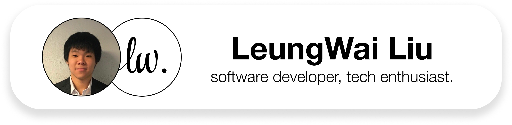

<picture>
  <source media="(prefers-color-scheme: light)" srcset="leungwailightbanner.png">
  <source media="(prefers-color-scheme: dark)" srcset="leungwaidarkbanner.png">
  
</picture>

# Hi 👋, I'm Leung Wai!

I am a software engineer and technology enthusiast. I enjoy coding, creating apps that optimizes people's daily lives, as well as optimizng and debugging code to make it look and run nice. I enjoy tinkering with hardware and software, tweaking and optimizing them to make it run to its fullest potential. I also love keeping up with the latest technology, especially smartphones, and PCs. As a recent undergraduate of Washington University in St. Louis, I hope to land a role in software engineering so that I can continue my passion of software engineering in a professional environment. 

## A little bit more about me:
- 🔭 I’m currently working on **my personal website** _(coming soon!)_
- 🌱 I’m currently refreshing on my **HTML/CSS/JS skills**
- ⚡ Fun facts:
  - I love trains 🚂!
  - My main laptop for 3 years was a $25 2012 MacBook Pro that I refurbished from the ground up

## Tech Stack

General:

    

App Development: 

 

Front End:

       

Back End: 

 

Design and Prototyping:

 

## Check out some of my GitHub Projects down below!

<!--
**leungwai/leungwai** is a ✨ _special_ ✨ repository because its `README.md` (this file) appears on your GitHub profile.

Here are some ideas to get you started:

- 🔭 I’m currently working on ...
- 🌱 I’m currently learning ...
- 👯 I’m looking to collaborate on ...
- 🤔 I’m looking for help with ...
- 💬 Ask me about ...
- 📫 How to reach me: ...
- 😄 Pronouns: ...
- ⚡ Fun fact: ...
-->
